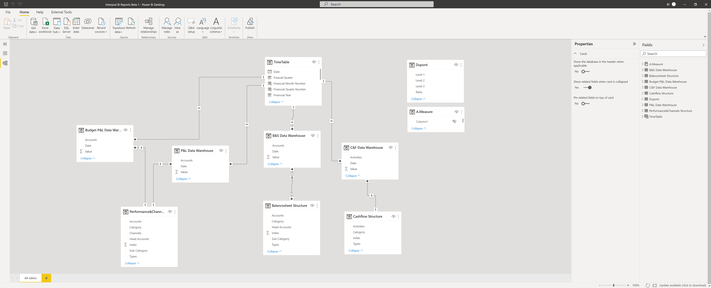
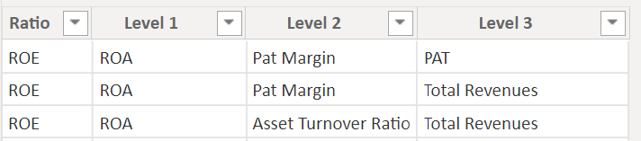
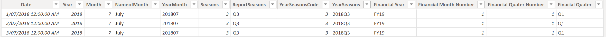

# FinancialReports-DynamicDashboard-PowerBI
*This is an independent project from my career that I have showcased in my repository. While all of the data has been changed to arbitrary values, there is sensitive information related to company in the dimension table. As a result, I will only post the measures that I created and screenshots to demonstrate the results.*


# Introduction


# Background 
Company is local retail, wholesale, and e-commerce business that has been in operation for over 20 years. It operates globally through online and offline channels in Australia, United Kingdom, and the United States. In terms of accounting and finance, Xero as our accounting system has been used for daily transactions, general journal entries, and month-end procedures. With several channels to manage, directors are extremely cautious about the performance and budget of each channel. However, Xero, being a basic accounting software, cannot provide comprehensive insights for the business to meet our directors' reporting requirements. Consequently, the directors have been relying on financial reports built in Excel during the last couple of years.

Several shortcomings and challenges have been identified in the accounting and finance processes after joining this company. These challenges have directly impacted my daily tasks and have significantly affected the efficiency of financial reporting. Therefore, I propose to create a dynamic BI dashboard that will improve the efficiency of financial reporting and provide directors with a comprehensive insight into the business.

# Challenges


Old Model of Profit & Loss Statements


Old Model of Cash Flow statements

    
- ### **Challenges of Data Source (Xero)**
    - XERO, as basic accounting software, does not permit direct access to its database for users. Therefore, the only feasible option to retrieve data from a record is to export the spreadsheet.


- ### **Challenges of Primary Keys (`Chart of Accounts` in Xero)**
    -  Over the years, almost 500 chart of accounts have been created in Xero to meet directors' requirements. These accounts are unstructured and unformatted, and are used to separate all sales, cost of goods sold (COGS), and operating expenses for each selling channel. However, when exporting data from Xero, these accounts are difficult to match with accounts in Excel reports. As a result, former accountants and I have to spend a lot of time manually transforming data from these.

- ### **Challenges of Stability of financial reports**
    - In this Excel report, there are multiple formulas are not functioning correctly and are not providing accurate information to report users. This is due to the Excel report being linked to various data source pages, analysis pages, and external sources. Some errors occur every time I update monthly figures in the worksheet, and I have to manually alter the formulas to overcome them one by one. I feel that this worksheet is unstable and could fall apart at any time, like a broken castle.

- ### **Challenges of maintainability of financial reports**
    - Besides the errors caused by incorrect formulas, there are over 15 tabs in these Excel reports in order to show data for each channel, as required by the directors. Each tab has the same 500 account categories with different data for each channel. When there is a requirement to add extra accounts or channels to the reports, these accounts has to be added to each tab related to the channels. It is not difficult to imagine how unreasonable and challenging to maintain this worksheet.


- ### **Challenges of readability and complexity of finacnail reports**
    - The report is excessively complex for primary users to read and understand, as there are too many columns on each page. For reporters, too much data is displayed on a single page, requiring them to scroll up and down and drag the page left and right. This can easily distract users' attention from the information they are trying to convey.

# Expectations
- To enhance the report's efficiency, it would be advantageous to incorporate an automated data retrieval system that can access the database either in real-time or periodically. By doing so, the report maintainer will be able to save a considerable amount of time that is currently being spent on manually exporting data from multiple sources.
- To improve the structure of the chart of accounts in Xero, it may be beneficial to create dimensions for the report using the chart of accounts as the primary key. Head accounts, categories, and sub-categories should be created for the Profit & Loss, Balance Sheet, and Cash Flow statements, with channels serving as a key dimension for the Profit & Loss. Time is another dimension that can be used to review reports at different time intervals.
- To enhance reports' reliability and stability, consider optimizing data model, using cached data, and avoiding custom visuals. It is also crucial to test reports before using it to ensure its accuracy.
- To improve maintainability, it is key to standardize report layout and design, use consistent naming conventions, create a data dictionary, use comments in formulas, and simplify complex calculations. Reports will become more consistent, easier to find and update, and more manageable.
- The dashboard of the new report should display key data with functions for drilling down into key categories and using filters and slicers to achieve time intelligence and segmentations of channels and categories. Furthermore, using simple visualizations such as bar charts, line charts, and funnels to demonstrate the trend, movement, and occupation of key data is necessary to increase readability and reduce the complexity of reports.


# Project Overview
This project is to build up dynamic dashboard of new report to meet my expectations and director`s requirements.

### Time : 3 months

### Software :  Excel, Power Query and Power BI.

### Steps : 
- 1. **Finding a way to access Database of Xero indirectly(Data Sources).**
    - I have searched for third-party integrations of Xero that enable Power BI to connect to the Xero database indirectly. Specifically, I am interested in [Acterys](https://acterys.com/) and [Odatalink](https://odatalink.com/).
- 2. **Restructuring and Reformatting the chart of accounts in Xero.**
    - Firstly, discuss and explain this step with manager and directors as they are not professional accoutant. they probably do not understand the meaning and affects for report when changes happened. In meanwhile, it is also opportuties of myself to understand this buiness in depth, which is helping me to accurately setup the accounts. 
    - Secondly, I setup new format of acccounts and unified their structure as `Accounts` + `channels` + `countries`. For example, the advertisting expense inccured for abc channel in United States. then the account will be restructed as `Adveristing expense abc us` and so on. 
    - Thirdly, setting up rules for unifing structures when adding up extra chart of accounts if requires.
- 3. **Preparing and clearning data sets from sources.**
    - This is key step to gurantee all useful data has been included in data model for next step and remove redundant or error data from the data model, which is possibility to reduce loading speed of reports.
- 4. **Data modelling**
    - Firstly, factor table, time table and dimentional tables should be prepared and orgainised hierarchically in proporties of power bi, which could improve stability and maintainability for data model.
    - Secondly, create entity relationship diagram (ERD), which could allow user to visual the relationships of tables in the model. 
- 5. **Generating measures by using Data Analysis Expressions (DAX) in Power BI.**
    - DAX is advanced query languages to bring functions, formulas, operator into your measures in Power BI. This is primary step to convert data set to useful information in reports.
- 6. **Building up visual dashboard.**
    - Using line chart, bar chart, pie chart, cards, martrix and funnels to simplely outline key data in dashboard adding time, channels and category slicer function for dynamically demenstrating information in different dementions to report users.
- 7. **Testing performance, and tailoring draft dashboard based on users`requiremnets.**
    - Whole point to rebuild new reports is to offer better experiences for report users - my directors and manger. So, their requirements and feelings of using thi report is very important. We will have couple of meeting to test this draft dashboard and to discuss which parts of dashboard can be altered to meet their needs and favoriates.

# Project Results

## ERD
<details>
<summary>
Click here to expand!
</summary>



⬇️`B&S Data Warehouse`


⬇️`Balancesheet Structure`


⬇️`Budget P&L Data Warehouse`

    

⬇️`C&F Data Warehouse`


⬇️`Cashflow Structure`


⬇️`Dupont`



⬇️`P&L Data Warehouse`


⬇️`P&L Data Warehouse`


⬇️`P&L Data Warehouse`



    
</details>

***

## Dashboards


### P&L Dashboard


### Trend and Allocation Dashboard


### B&S Dashboard


### CashFlow Dashboard


***


## A.Measure


## A.A.P&L Measures
### Gross Profit
```
[Total Income]-[Total Cost of Sales]
```
### Net Profit
```
[Gross Profit]+[Total Other Incomes]-[Total Operating Expenses]
```
### Total Cost of Sales
```
CALCULATE([Total Value of PL],FILTER('Performance&Channels Structure',[Head Accounts]="Cost of Sales"))
```
### Total Income
```
CALCULATE([Total Value of PL],FILTER('Performance&Channels Structure',[Head Accounts]="Income"))
```
### Total Operating Expenses
```
CALCULATE([Total Value of PL],FILTER('Performance&Channels Structure',[Head Accounts]="Operating Expenses"))
```
### Total Other Incomes
```
CALCULATE([Total Value of PL],FILTER('Performance&Channels Structure',[Head Accounts]="Other Incomes"))
```
### Total Value of PL
```
SUM('P&L Data Warehouse'[Value])
```
### Total value of PL FYTD
```
CALCULATE([Total Value of PL],DATESYTD('TimeTable'[Date],"30/6"))
```
## A.B.P&L Measures
### B.Gross Profit
```
[Total B.Income]-[Total B.Cost of Sales]
```
### B.Net Profit
```
[B.Gross Profit]+[Total B.Other Incomes]-[Total B.Operating Expenses]
```
### Total B.Cost of Sales
```
CALCULATE([Total Value of B.PL],FILTER('Performance&Channels Structure',[Head Accounts]="Cost of Sales"))
```
### Total B.Income
```
CALCULATE([Total Value of B.PL],FILTER('Performance&Channels Structure',[Head Accounts]="Income"))
```
### Total B.Operating Expenses
```
CALCULATE([Total Value of B.PL],FILTER('Performance&Channels Structure',[Head Accounts]="Operating Expenses"))
```
### Total B.Other Incomes
```
CALCULATE([Total Value of B.PL],FILTER('Performance&Channels Structure',[Head Accounts]="Other Incomes"))
```
### Total Value of B.PL
```
SUM('Budget P&L Data Warehouse'[Value])
```
### Total value of PL B.FYTD
```
CALCULATE([Total Value of B.PL],DATESYTD('TimeTable'[Date],"30/6"))
```
### Var Budget
```
[Total Value of PL]-[Total Value of B.PL]
```
### Var Budget%
```
DIVIDE([Var Budget],[Total Value of B.PL])
```
### Var Budget.YTD
```
[Total value of PL FYTD]-[Total value of PL B.FYTD]
```
### Var Budget.YTD%
```
DIVIDE([Var Budget.YTD],[Total value of PL B.FYTD])
```
## A.LY.P&L Measures
### Gross Profit L.Year
```
CALCULATE([Gross Profit],SAMEPERIODLASTYEAR('TimeTable'[Date]))
```
### Net Profit L.Year
```
CALCULATE([Net Profit],SAMEPERIODLASTYEAR('TimeTable'[Date]))
```
### Total Cost of Sales L.Year
```
CALCULATE([Total Cost of Sales],SAMEPERIODLASTYEAR('TimeTable'[Date]))
```
### Total Income L.Year
```
CALCULATE([Total Income],SAMEPERIODLASTYEAR('TimeTable'[Date]))
```
### Total Operating Expenses L.Year
```
CALCULATE([Total Operating Expenses],SAMEPERIODLASTYEAR('TimeTable'[Date]))
```
### Total Other Incomes L.Year
```
CALCULATE([Total Other Incomes],SAMEPERIODLASTYEAR('TimeTable'[Date]))
```
### Total Value of PL L.Year
```
CALCULATE([Total Value of PL],SAMEPERIODLASTYEAR('TimeTable'[Date]))
```
### Total value of PL L.Year FYTD
```
CALCULATE([Total Value of PL L.Year],DATESYTD('TimeTable'[Date],"30/6"))
```
### Var LY
```
[Total Value of PL]-[Total Value of PL L.Year]
```
### Var LY%
```
DIVIDE([Var LY],[Total Value of PL L.Year])
```
### Var LY.YTD
```
[Total value of PL FYTD]-[Total value of PL L.Year FYTD]
```
### Var LY.YTD%
```
DIVIDE([Var LY.YTD],[Total value of PL L.Year FYTD])
```
## B.B&S Measures
### Month on Month
```
DIVIDE([Total Value of BS(Ending Balance)]-[Total Value of BS(Begining Balance)],[Total Value of BS(Begining Balance)])
```
### Total Non-Current Asset
```
CALCULATE([Total Value of BS(Ending Balance)], FILTER('B&S Data Warehouse','B&S Data Warehouse'[Accounts]="Total Non-current Assets"))
```
### Total Non-Current liability
```
CALCULATE([Total Value of BS(Ending Balance)], FILTER('B&S Data Warehouse','B&S Data Warehouse'[Accounts]="Total Non-current Liabilities"))
```
### Total Value of BS(Begining Balance)
```
OPENINGBALANCEMONTH([Total Value of BS(Ending Balance)],'TimeTable'[Date])
```
### Total Value of BS(Ending Balance)
```
SUM('B&S Data Warehouse'[Value])
```
### Total value of BS(Previous Year)
```
CALCULATE([Total Value of BS(Ending Balance)],SAMEPERIODLASTYEAR('TimeTable'[Date]))
```
### Year on Year
```
DIVIDE([Total Value of BS(Ending Balance)]-[Total value of BS(Previous Year)],[Total value of BS(Previous Year)])
```
## C.C&F Measures
### CF MOM
```
DIVIDE([Total Value of CF],[Total Value of CF begining])
```
### CF YOY
```
DIVIDE('A.Measure'[Total Value of CF],[Total Value of CF previous year])
```
### Total Value of CF
```
SUM('C&F Data Warehouse'[Value])
```
### Total Value of CF begining
```
CALCULATE([Total Value of CF],PREVIOUSMONTH(TimeTable[Date]))
```
### Total Value of CF previous year
```
CALCULATE([Total Value of CF],SAMEPERIODLASTYEAR('TimeTable'[Date]))
```
## D.Margin Ratios(PL)
### %Gross Margin
```
DIVIDE([Gross Profit],[Total Income])
```
### %Gross Margin previous month
```
CALCULATE([%Gross Margin],PREVIOUSMONTH('TimeTable'[Date]))
```
### %Net Margin
```
DIVIDE([Net Profit],[Total Income])
```
### %Net Margin previous month
```
CALCULATE([%Net Margin],PREVIOUSMONTH('TimeTable'[Date]))
```
## E.Debt Ratio(BS)
### %Debt ratio(Begining)
```
OPENINGBALANCEMONTH([%Debt ratio(Ending)],'TimeTable'[Date])
```
### %Debt ratio(Ending)
```
DIVIDE([Total Liabilities],[Total assets])
```
### Total assets
```
CALCULATE([Total Value of BS(Ending Balance)],FILTER('B&S Data Warehouse',[Accounts]="Total Assets"))
```
### Total Liabilities
```
CALCULATE([Total Value of BS(Ending Balance)],FILTER('B&S Data Warehouse',[Accounts]="Total Liabilities"))
```
## F.ROE Ratio(BS)
### %ROE(Begining)
```
CALCULATE([%ROE(Ending)],PREVIOUSMONTH('TimeTable'[Date]))
```
### %ROE(Ending)
```
DIVIDE([Annualized Net Profit],[Average Net Asset])
```
### Annualized Net Profit
```
[Net Profit for Annualize]/SELECTEDVALUE('TimeTable'[Month])*12
```
### Average Net Asset
```
([Total Equity]+[Begining Balanace of Total Equity])/2
```
### Begining Balanace of Total Equity
```
OPENINGBALANCEMONTH([Total Equity],'TimeTable'[Date])
```
### Net Profit for Annualize
```
CALCULATE([Total Value of PL],FILTER(ALL('Performance&Channels Structure'),'Performance&Channels Structure'[Accounts]="Net Profit"))
```
### Total Equity
```
CALCULATE([Total Value of BS(Ending Balance)],FILTER(ALL('Balancesheet Structure'),[Accounts]="Total Equity"))
```
##G.DSO(BS)
### Accounts Receivable(Ending)
```
CALCULATE([Total Value of BS(Ending Balance)],FILTER('Balancesheet Structure',[Accounts]="Total Debtors"))
```
### DSO (Ending)
```
DIVIDE([Accounts Receivable(Ending)],[Total Income])*30
```
### DSO(Begining)
```
CALCULATE([DSO (Ending)],PREVIOUSMONTH('TimeTable'[Date]))
```
## H.DPO(BS)
### DPO (Begining)
```
CALCULATE([DPO (Ending)],PREVIOUSMONTH('TimeTable'[Date]))
```
### DPO (Ending)
```
"VAR AP = CALCULATE([Total Value of BS(Ending Balance)],FILTER('B&S Data Warehouse','B&S Data Warehouse'[Accounts]=""Total Creditors""))
    VAR COGS = CALCULATE([Total Value of PL],FILTER('P&L Data Warehouse','P&L Data Warehouse'[Accounts]=""Total Cost of Sales""))
RETURN
    DIVIDE(AP,COGS)*30"
```
## I.Current&Quick Ratio(BS)
### Current Ratio Begining
```
OPENINGBALANCEMONTH([Current Ratio ending],'TimeTable'[Date])
```
### Current Ratio ending
```
DIVIDE([Total Current Asset(Include Bank)],[Total Current liability])
```
### Quick Ratio
```
DIVIDE([Total Current asset without inventory],[Total Current liability])
```
### Quick Ratio begining
```
OPENINGBALANCEMONTH([Quick Ratio],'TimeTable'[Date])
```
### Total Current asset without inventory
```
"VAR I = CALCULATE('A.Measure'[Total Value of BS(Ending Balance)],FILTER('B&S Data Warehouse','B&S Data Warehouse'[Accounts]=""Total Inventory""))
Return
    CALCULATE([Total Current Asset(Include Bank)]-I)"
```
### Total Current Asset(Include Bank)
```
"Var CA = CALCULATE([Total Value of BS(Ending Balance)], FILTER('B&S Data Warehouse','B&S Data Warehouse'[Accounts]=""Total Current Assets""))
    Var Bank = CALCULATE([Total Value of BS(Ending Balance)],FILTER('B&S Data Warehouse','B&S Data Warehouse'[Accounts]=""Total Bank""))
Return
    CALCULATE(CA+Bank)"
```
### Total Current Asset(Include Bank) Begining
```
OPENINGBALANCEMONTH([Total Current Asset(Include Bank)],'TimeTable'[Date])
```
### Total Current liability
```
CALCULATE([Total Value of BS(Ending Balance)], FILTER('B&S Data Warehouse','B&S Data Warehouse'[Accounts]="Total Current Liabilities"))
```
### Total Current liability Begining
```
OPENINGBALANCEMONTH('A.Measure'[Total Current liability],'TimeTable'[Date])
```
## J.Comparing(CF)

### Net CF FROM FA
```
CALCULATE('A.Measure'[Total Value of CF],FILTER('C&F Data Warehouse','C&F Data Warehouse'[Activities]="Net Cash Flows from Financing Activities"))
```
### Net CF FROM FA Begining
```
CALCULATE([Net CF FROM FA],PREVIOUSMONTH('TimeTable'[Date]))
```
### Net CF FROM IA
```
CALCULATE('A.Measure'[Total Value of CF],FILTER('C&F Data Warehouse','C&F Data Warehouse'[Activities]="Net Cash Flows from Investing Activities"))
```
### Net CF FROM IA Begining
```
CALCULATE([Net CF FROM IA],PREVIOUSMONTH('TimeTable'[Date]))
```
### Net CF FROM OA
```
CALCULATE([Total Value of CF],FILTER('C&F Data Warehouse','C&F Data Warehouse'[Activities]="Net Cash Flows from Operating Activities"))
```
### Net CF FROM OA Begining
```
CALCULATE([Net CF FROM OA],PREVIOUSMONTH('TimeTable'[Date]))
```

